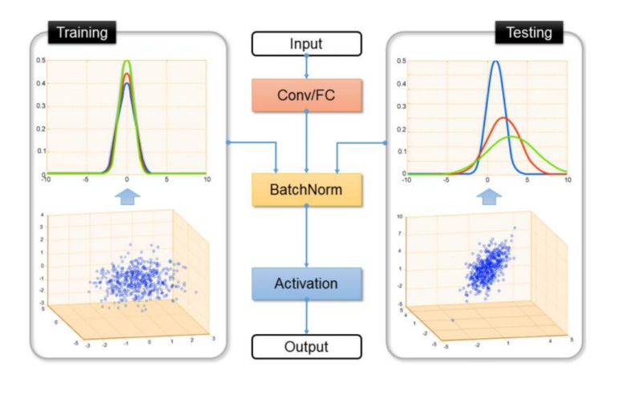

## 第三类方法：子空间学习

#### 假设：

* 源域和目标数据在变换后的子空间中有相似的分布

#### 分类：根据特征变换的形式分为

* 基于 统计特征变换 的统计特征对齐方法
* 基于 流形变换 的 流形学习方法

### 统计特征对齐

#### 主要思想：

* 将数据的统计特征进行变换对齐，后利用传统机器学习的方法构建分类器训练

#### 代表方法：

##### SA（Subspace Alignment）(2013)

* **主要思想**： 寻找线性变换$M$使得不同域的数据对齐
* **优化目标**： $\begin{equation}F(\mathbf{M})=\left\|\mathbf{X}_{s} \mathbf{M}-\mathbf{X}_{t}\right\|_{F}^{2}\end{equation}$

##### SDA(subspace Distribution Alignment)(2015)

* **主要思想**：子空间变换的基础上$T$,加入概率分布自适应变换$A$
* **优化目标**： $\begin{equation}\mathbf{M}=\mathbf{X}_{s} \mathbf{T} \mathbf{A} \mathbf{X}_{t}^{\top}\end{equation}$  (可以由SA方法两项都乘$X_t^{T}$,再去掉常数$X_t * X_t^{T}$得到 ）

##### CORAL（CORrelation Alignment）

* **主要思想**：对领域的二阶特征对齐
* **优化目标**：$C_s$和$C_t$为域的协方差矩阵，学习二阶特征变换$A$，使得$\begin{equation}\min _{\mathbf{A}}\left\|\mathbf{A}^{\top} \mathbf{C}_{s} \mathbf{A}-\mathbf{C}_{t}\right\|_{F}^{2}\end{equation}$
* **二阶统计特征距离**：CORAL损失：$\begin{equation}\ell_{C O R A L}=\frac{1}{4 d^{2}}\left\|\mathbf{C}_{s}-\mathbf{C}_{t}\right\|_{F}^{2}\end{equation}$
* **在神经网络领域的应用**：

### 流形学习

#### 基本假设：

* 现有的数据是从高维空间中采样出来的，故具有高维空间中的低维流形结构（我认为：即在高维空间中的几何度量方式和低维空间会有不同，但也是具有度量特征的）

#### 流形空间中的距离度量：测地线

* 在高维数据中展开后得到的距离度量方式

#### 主要思想：

* 在流形空间中的特征通常都有着很好的几何性质，可以避免特征扭曲，因此通常将原始空间下的特征变换到流形空间中，后利用分类器训练。
* 在众多已知的流形中，Grassmann 流形 $G(d) $可以通过将原始的 $d$ 维子空间 (特征向量) 看作它基础的元素，从而可以帮助学习分类器。

#### 代表方法：

##### SGF

* **主要思想**：将源域与目标域看成高维空间中的两个点，在两者的测地线上去$d$个中间点依次连接，那么只要找到相邻两点的合理变换，即可完成域迁移
* **示意图**：
* **不足**：$d$没法估计

##### GFK(Geodesic Flow Kernel)

* 基于SGF的改进版
* **确定d**：提出一种核学习的方法，利用路径上的无穷个点的积分
* **确定使用的源域**：当有多个源域的时候，我们如何决定使用哪个源域跟目标域进行迁移？GFK 通过提出 Rank of Domain 度量，度量出跟目标域最近的源域

### 扩展与小结

## 深度迁移学习

### 深度网络的可迁移性

* 深度网络的前几层学习的都是较为general feature
* 迁移神经网络的前几层可隐式的增加训练数据

### 代表方法

#### Finetune

* **主要思想**： 取已经训练好的别的模型，根据自己数据集的特点进行改造。
* **优势**：隐式的增加训练数据；效果比随机初始化权重好；时间短
* **扩展**：对于传统学习方式，可以利用神经网络自动提取特征的特性避免手工特征的提取
* **缺点**： 假设训练数据和测试数据服从相同的分布

#### 深度网络自适应

* **基本思想**：针对源域和目标域上数据分布的不一致性，开发出自适应层。故不用的方法之间的区别主要是1）什么层可以自适应，2）什么样的自适应方法（度量准则）
* **基本流程**：决定自适应层，在层中加入自适应度量，对网络进行finetune。
* **网络损失定义**：$\begin{equation}\ell=\ell_{c}\left(\mathcal{D}_{s}, \mathbf{y}_{s}\right)+\lambda \ell_{A}\left(\mathcal{D}_{s}, \mathcal{D}_{t}\right)\end{equation}$
* **代表方法**：
  * **DDC(Deep Domain Confusion)：**(2014)
    * **方法**：固定AlexNet前7层，在第 8 层 (分类器前一层) 上加入了 MMD 准则。
    * **损失函数**：$\begin{equation}\ell=\ell_{c}\left(\mathcal{D}_{s}, \mathbf{y}_{s}\right)+\lambda M M D^{2}\left(\mathcal{D}_{s}, \mathcal{D}_{t}\right)\end{equation}$
    * **网络结构图**:
  * **DAN(Deep Adaptation Networks):**(2015)
    * **方法**：在AlexNet的后三层找中加入三个自适应层，并在每层总采用表征能力更好的多核MMD度量。
    * **优化目标**：$\begin{equation}\min _{\Theta} \frac{1}{n_{a}} \sum_{i=1}^{n_{a}} J\left(\theta\left(\mathbf{x}_{i}^{a}\right), y_{i}^{a}\right)+\lambda \sum_{l=l_{1}}^{l_{2}} d_{k}^{2}\left(\mathcal{D}_{s}^{l}, \mathcal{D}_{t}^{l}\right)\end{equation}$
    * **模型结构**：
  * **同时迁移领域和任务**( joint CNN architecture for domain and task transfer)2015
    * **主要思想**：在迁移domain的同时，利用class之间的相似度，同时约束条件概率分布。
    * **优化目标**：$\begin{equation}\begin{aligned}
      L\left(x_{S}, y_{S}, x_{T}, y_{T}, \theta_{D} ; \theta_{r e p r}, \theta_{C}\right)=& L_{C}\left(x_{S}, y_{S}, x_{T}, y_{T} ; \theta_{r e p r}, \theta_{C}\right) \\
      &+\lambda L_{c o n f}\left(x_{S}, x_{T}, \theta_{D} ; \theta_{r e p r}\right)+v L_{s o f t}\left(x_{T}, y_{T} ; \theta_{r e p r}, \theta_{C}\right)
      \end{aligned}\end{equation}$
    * **模型结构**：主要是在7层后加了domain classifier，在8层后计算网络的loss和soft label的loss
    * **soft label loss**：根据source domain中每个类别的分布概率，来约束target中预测得到的概率的分布，相当于约束了条件概率分布。
  * **深度联合分布自适应**（JAN Joint Adaptation Network）2017
    * 将只对数据进行自适应的方式推广到了对类别的自适应，提出了 JMMD 度量 (Joint MMD)。
    * 
  * **AdaBN(Adaptive Batch Normalization)**2018
    * 通过在归一化层加入统计特征的适配
    * 

#### 深度对抗网络迁移

* **基本思想**：在GAN结构中，将目标域的数据当成生成的样本，那么此时生成器的作用相当于提取特征，而对抗学习的过程相当于不断的学习领域数据的特征使得判别器无法对两个领域进行判别。通常用 $G_f$ 来表示特征提取器， 用 $G_{d}$ 来表示判别器。
* **目标函数**： $\begin{equation}\ell=\ell_{c}\left(\mathcal{D}_{s}, \mathbf{y}_{s}\right)+\lambda \ell_{d}\left(\mathcal{D}_{s}, \mathcal{D}_{t}\right)\end{equation}$
* **代表方法**
  * **DANN(Domain-Adversarial Neural Network)**2016
    * **主要思想**：在最大化源域分类精度的同时，使得判别器无法判断特征来源。故网络的loss由类别loss和域分类loss两个部分组成。
    * **主要流程**：对源域和目标域进行特征提取，将源域的特征送入分类器中产生类别预测损失，将源域和目标域的特征送入域分类器中产生域分类损失。
    * **优化目标**：$\begin{array}{l}
      E(\mathbf{W}, \mathbf{V}, \mathbf{b}, \mathbf{c}, \mathbf{u}, z) \\
      \quad=\frac{1}{n} \sum_{i=1}^{n} \mathcal{L}_{y}^{i}(\mathbf{W}, \mathbf{b}, \mathbf{V}, \mathbf{c})-\lambda\left(\frac{1}{n} \sum_{i=1}^{n} \mathcal{L}_{d}^{i}(\mathbf{W}, \mathbf{b}, \mathbf{u}, z)+\frac{1}{n^{\prime}} \sum_{i=n+1}^{N} \mathcal{L}_{d}^{i}(\mathbf{W}, \mathbf{b}, \mathbf{u}, z)\right)
      \end{array}$
      * 首项是类别预测损失：$\mathcal{L}_{y}\left(G_{y}\left(G_{f}\left(\mathbf{x}_{i}\right)\right), y_{i}\right)=\log \frac{1}{G_{y}\left(G_{f}(\mathbf{x})\right)_{y_{i}}}$
      * 末项是域分类损失：$\mathcal{L}_{d}\left(G_{d}\left(G_{f}\left(\mathbf{x}_{i}\right)\right), d_{i}\right)=d_{i} \log \frac{1}{G_{d}\left(G_{f}\left(\mathbf{x}_{i}\right)\right)}+\left(1-d_{i}\right) \log \frac{1}{G_{d}\left(G_{f}\left(\mathbf{x}_{i}\right)\right)}$
    * **模型结构**：
  * **DSN(domain separation networks)**2016
    * **主要思想**：源域和目标域都是由共有部分和私有部分组成的，公共部分可以学习公共的特征，私有部分用来保持各个领域独立的特性。如果迁移时同时对私有部分进行迁移会造成负迁移。故DSN的主要工作是提取不同域之间的共有特征并进行迁移。
    * **模型结构**：
      * Private Target Encoder ![[公式]](https://www.zhihu.com/equation?tex=E_p%5E%7Bt%7D%28x%5Et%29) : 目标域私有编码器，用来提取目标域的私有特征。
      * Private Source Encoder ![[公式]](https://www.zhihu.com/equation?tex=E_p%5E%7Bs%7D%28x%5Es%29) : 源域私有编码器，用来提取源域的私有特征。
      * Shared Encoder ![[公式]](https://www.zhihu.com/equation?tex=E_c%28x%29) : 共享编码器，用来提取源域和目标域的公有特征。
      * Shared Decoder ![[公式]](https://www.zhihu.com/equation?tex=D%28E_c%28x%29%2BE_p%28x%29%29) : 共享解码器，用来将私有特征和公有特征组成的样本进行解码。
      * Classifier ![[公式]](https://www.zhihu.com/equation?tex=G%28E_c%28x%5Es%29%29) : 分类器，在训练时用来对源域样本进行分类，在训练完成时就可以直接用在目标域数据上进行分类
    * **优化目标**：$\ell=\ell_{\text {task}}+\alpha \ell_{\text {recon}}+\beta \ell_{\text {difference}}+\gamma \ell_{\text {similarity}}$
      * $L_{\text {difference }}=\left\|\mathbf{H}_{c}^{s^{\top}} \mathbf{H}_{p}^{s}\right\|_{F}^{2}+\left\|\mathbf{H}_{c}^{t^{\top}} \mathbf{H}_{p}^{t}\right\|_{F}^{2}$
      * 相似损失可以有两种度量:
        * $\mathcal{L}_{\text {similarity }}^{\mathrm{DANN}}=\sum_{i=0}^{N_{s}+N_{t}}\left\{d_{i} \log \hat{d}_{i}+\left(1-d_{i}\right) \log \left(1-\hat{d}_{i}\right)\right\}$
        * $\mathcal{L}_{\text {similarity }}^{\mathrm{MMD}}=\frac{1}{\left(N^{s}\right)^{2}} \sum_{i, j=0}^{N^{s}} \kappa\left(\mathbf{h}_{c i}^{s}, \mathbf{h}_{c j}^{s}\right)-\frac{2}{N^{s} N^{t}} \sum_{i, j=0}^{N^{s}, N^{t}} \kappa\left(\mathbf{h}_{c i}^{s}, \mathbf{h}_{c j}^{t}\right)+\frac{1}{\left(N^{t}\right)^{2}} \sum_{i, j=0}^{N^{t}} \kappa\left(\mathbf{h}_{c i}^{t}, \mathbf{h}_{c j}^{t}\right)$
    * **主要流程**：
      * 需要使得域的共有部分和私有部分分开：故给每个域分别训练私有解码器和共有解码器，用$ \ell_{\text {difference}}$表示提取出的公共特征和私有特征的相似度
      * 需要使得两个域的共有部分相似度大，故用$\ell_{\text {similarity}}$表示两个域共有特征的相似度
      * 需要保证特征的完整性和有效性（避免 ![[公式]](https://www.zhihu.com/equation?tex=h_p%5E%7Bs%7D+%3D+0%EF%BC%8Ch_p%5E%7Bt%7D+%3D+0+%EF%BC%8Ch_c%5E%7Bs%7D+%3Dh_c%5E%7Bt%7D+%3D1)的情况）：故构造了编码器，用重构损失$\ell_{\text {recon}}$约束
      * 最终目标是在目标域上的分类器，故根据公共特征，基于源域的打标数据构造分类器即可。
  * ==**SAN**==
    * ==**主要思想**：通常的迁移学习中，源域数据的类别通常比目标域数据更加丰富，在对只存在于源域的类别迁移是，会对迁移结果造成负面影响。==没看懂
  * **DAAN (Dynamic Adversarial Adaptation Networks) **